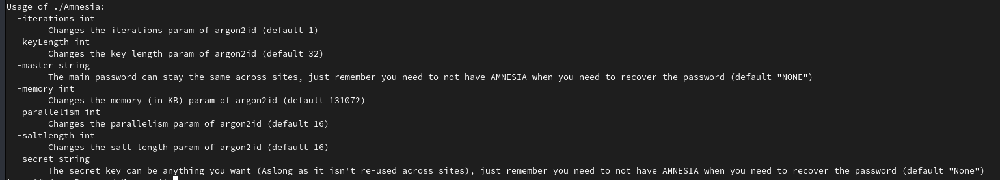
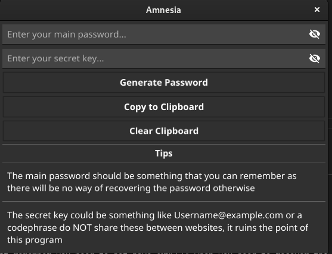

# Amnesia, The password "manager" you never thought you would need

# Requirements
GCC (due to CGo)

Golang (Any relatively-recent version should work fine, tested with 1.18)

Make (Not a hard requirement obviously)

# Installation
By default Amnesia is installed to /usr/local/bin, change the path in the makefile if needed.

`sudo make clean install`

to uninstall

`sudo make uninstall`

to run without installing

`make run`

# Pros
- The lack of storage means that your interrogators will never be able to get your password from you!
- One password for everything without the risk of losing all of your accounts because of a single database breach
- Can be used for more stuff than just passwords
- Essentially immune to drive failure if used correctly
- Your password will survive the end of computers as you know it.

# Cons
- The interrogators can still ask you for your master password and secret phrase
- You might forget both your master password and secret phrase and not even Amnesia can save you this time
- Because of the fact your password will survive the end of computers, humans might eventually decrypt your password by carving the algorithm into a rock. Good thing you'll be dead long before that happens!

# FAQ
## Why?
Science.
## Does it come with both GUI and CLI options?
Of course, but with the CLI version the options you pick will be in your command history, as it's purpose is more for scripts than standalone use.
## How can I trust this more than your standard password manager?
You can't, you have to trust my ability to program, googles engineers who made the crypto library and [this project](https://github.com/ory/kratos) because that is where the default argon2 settings came from. (Can be changed via CLI)
## Why is manager in quotes?
That is because the passwords are not stored, the only place they're stored is in your memory.
## Why is it made in Go and not in a lower-level language?
Simplicity, and because I felt like it. If needed, it can be rewritten in C. (Eventually)
## How is this a password manager then?
Instead of needing to store passwords somewhere you're basically telling it to generate your password 

based off of a master password (That stays the same always), and a "Secret Phrase" (That should be different per site)

Then just like magic, you can generate your password on the fly!

| Master Pass    | Secret Phrase    | Generated Password    |
|---------------- | --------------- | --------------- |
| P@55w0rd123    | Username@example.com    | KfEFxQ/N++LgWvpM0sKSi3auv50vD4O3lSLxp0aYSCwVXNlcm5hbWVAZXhhbXBsZS5jb20    |
| P@55w0rd123    | Username@theobviouslycoolerexample.com    | 52EQo8MRTZUytg2IzIqzk+pIkVlMJOfOfuvqsG8iJ6UVXNlcm5hbWVAdGhlb2J2aW91c2x5Y29vbGVyZXhhbXBsZS5jb20    |

# Screenshot

## CLI version 

## GUI version

